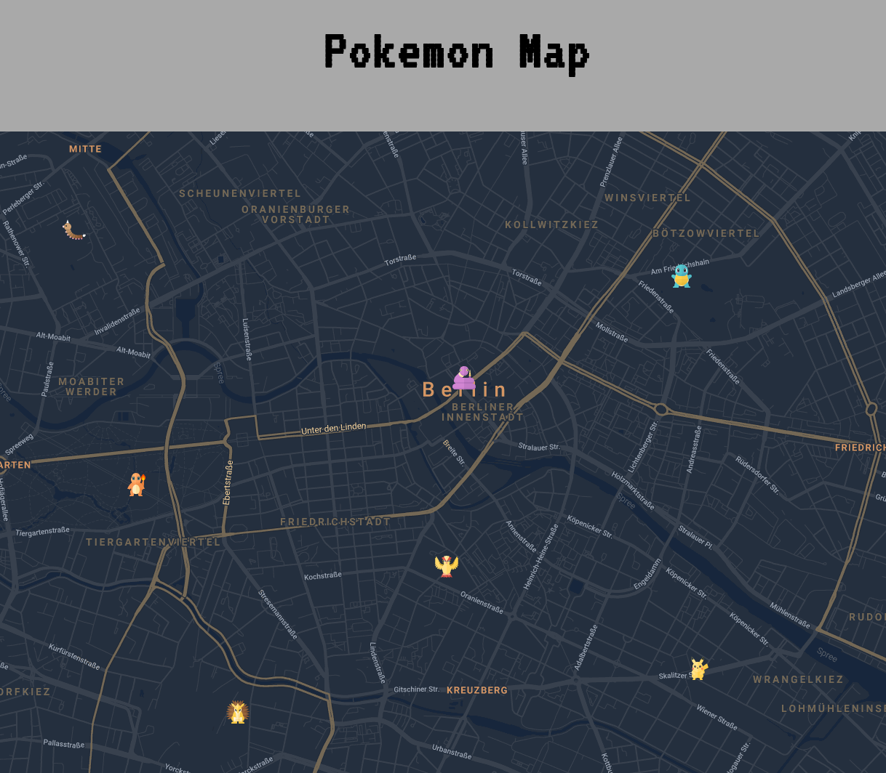

# DevProjects - Google Map Marker

This is an open source project from [DevProjects](http://www.codementor.io/projects). Feedback and questions are welcome!
Find the project requirements here: [Custom google maps theme](https://www.codementor.io/projects/web/build-a-custom-google-maps-theme-bf8levr6eg)

## SVGS
The svgs were kindly provided by [@TheArtificial](https://theartificial.github.io/pokemon-icons/#download)

## Screenshots and demo

## Tech stack
html
js

dependencies:
  google maps API
  parcel bundler
  dotenv

## License
[MIT](https://choosealicense.com/licenses/mit/)
Most open source projects use the MIT license. Feel free to choose whichever license you prefer.

